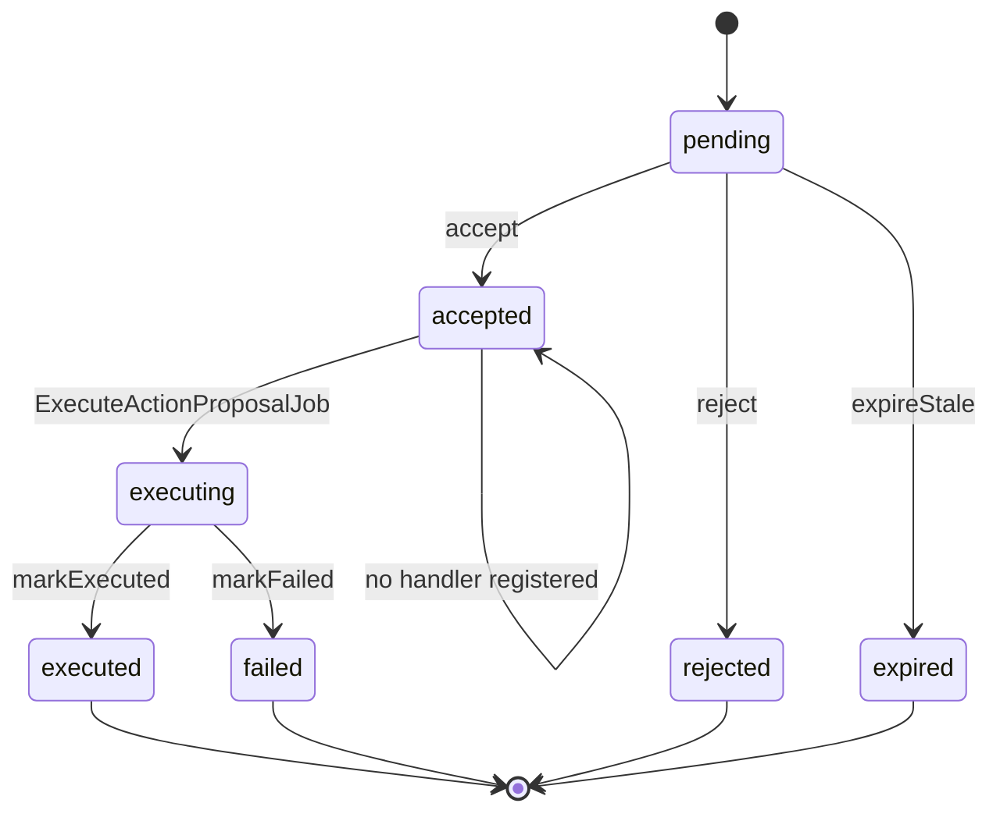

# homeside/laravel-ai-agents

Reusable Laravel AI infrastructure: agent registry, provider resolution,
hierarchical prompting with guardrails, execution recording and per-module
configuration — built on top of the official **Laravel AI SDK** (`laravel/ai`).

The package is domain-agnostic: every consuming application registers its own
Agents, Tools, Modules and Context Providers through the published
configuration.

## Requirements

- PHP `^8.2`
- Laravel `^13.0`
- `laravel/ai: ^1.1`

## Installation

```bash
composer require homeside/laravel-ai-agents
```

The package auto-registers its service provider via package discovery.
Migrations load automatically through `loadMigrationsFrom()`.

Publish the configuration (recommended) and, if you prefer owning the
migrations in your app, publish them too:

```bash
php artisan vendor:publish --tag=ai-agents-config
php artisan vendor:publish --tag=ai-agents-migrations
```

### Laravel Boost

During a new Boost installation, select skills and `homeside/laravel-ai-agents` when prompted:

```bash
php artisan boost:install
```

For an existing Boost installation, discover the newly installed package and select it:

```bash
php artisan boost:update --discover
```

Later `boost:update` runs refresh an already selected package skill.

### Development (this repository)

The package ships a minimal Docker environment (PHP 8.4 + Composer +
pdo_sqlite) so the QA suite runs identically on any host:

```bash
make build      # build the development image
make install    # composer install from composer.lock
make qa         # pint --test + phpstan + phpunit
make test       # phpunit only
make lint       # fix style issues with pint
make analyse    # phpstan only
make shell      # shell inside the container
```

Equivalent raw command: `docker compose run --rm qa <command>` from this
directory.

### Host configuration

`config/ai-agents.php` exposes:

| Key | Description |
|---|---|
| `user_model` | Class-string of the host's user model (used by relationships). |
| `users_table` | Users table name used by the package migrations. |
| `fallback_module` | Module identifier used when an agent's module has no dedicated provider. |
| `tenant` | Optional tenant support block — see [Optional tenant support](#optional-tenant-support). |
| `agents` | Array of `DomainAgent` class-strings to register. |
| `modules` | Array of `ModuleAiProvider` class-strings to register. |
| `context_providers` | Array of `ContextProvider` class-strings to register. |
| `proposals` | Human-in-the-loop action proposal lifecycle — see [Action proposals](#action-proposals-human-in-the-loop). |
| `conversations` | Persistent chat memory for conversational agents — see [Conversation memory](#conversation-memory). |
| `embeddings` | Generic embeddings infra (cache, timeout, batch size) — see [Per-capability model defaults & embeddings](#per-capability-model-defaults--embeddings). |
| `injection_patterns` | Regex list used by `PromptCompositor` guardrails; extend or replace per host. |

## Registering Agents and Modules

The service provider walks `config('ai-agents.agents')`,
`config('ai-agents.modules')` and `config('ai-agents.context_providers')`
and registers each class in the `AgentRegistry` / `ContextBuilder`.

Example host configuration:

```php
// config/ai-agents.php
'agents' => [
    App\Ai\Agents\RecipeGeneratorAgent::class,
    App\Ai\Agents\TicketAnalyzerAgent::class,
],

'modules' => [
    App\Ai\Modules\RecipesAiModule::class,
],

'context_providers' => [
    App\Ai\Context\Providers\ProfileContextProvider::class,
],
```

Use the published stubs (`php artisan vendor:publish --tag=ai-agents-stubs`)
or the ones bundled in `stubs/Agent.php.stub`, `stubs/Module.php.stub`,
`stubs/Tool.php.stub` and `stubs/ActionProposalTool.php.stub` as templates
for the host classes.

Tools that touch host domain models (recipes, products, lists...) or that
need storage/routing — e.g. an image-generation tool backed by a host
service — live in the host application and are listed in the agent's
`tools()` method. The package ships no domain tools. When writing tools,
authorise inside `handle()` against your domain models and policies: the
model only provides inputs, never permissions.

## Agent Skills

Skills are reusable instruction bundles (a directory with `SKILL.md` plus
optional files) the model loads on demand. The SDK injects a `LoadSkill`
tool automatically when an agent implements `HasSkills`. This package wraps
that with a registry so skills are discovered, validated and firewall
inspected once:

```php
'skills' => [
    'enabled' => env('AI_AGENTS_SKILLS_ENABLED', true),
    'directories' => [resource_path('skills')],   // scanned for '<name>/SKILL.md'
    'providers' => [App\Ai\Skills\ApplicationSkills::class], // ProvidesSkills
    'firewall' => env('AI_AGENTS_SKILLS_FIREWALL', true),
],
```

An agent exposes skills by implementing `HasSkills` and using
`UsesAgentSkills` (restrict to a named subset with `skillsNamed([...])`).
`ProvidesSkills` implementations registered in `skills.providers` contribute
skills programmatically and override same-named directory skills. With
`skills.firewall` on, each skill's instructions pass through the bound
`InspectsPrompt`; a blocked skill is dropped with a warning. Inspect the
effective set with:

```bash
php artisan ai-agents:skills:sync
```

### Agent contract

A domain agent implements the Laravel AI SDK native interfaces (`Agent`,
`HasTools`, `HasStructuredOutput`, ...) plus the package's
`HomeSide\AiAgents\Contracts\DomainAgent` interface, which declares the
metadata: `key()`, `module()`, `version()`, `requiredCapabilities()`,
`defaultConfiguration()`, `contextProviders()`, `maxContextTokens()` and
`requiredPrivacyLevel()`.

Optionally implement `HomeSide\AiAgents\Contracts\AgentMetadata` to give the
synchroniser a label, description and default parameters.

### Module contract

A module implements `HomeSide\AiAgents\Contracts\ModuleAiProvider`, declaring
its `AiProviderModule` case and the agents it needs (label, system prompt,
parameters). These defaults seed the `ai_agents` and
`module_ai_configurations` rows.

## Agent privacy gate

An agent may declare the minimum privacy level its data allows through
`DomainAgent::requiredPrivacyLevel()` (null = no restriction):

```php
public function requiredPrivacyLevel(): ?PrivacyLevel
{
    return PrivacyLevel::Local; // never send this data to cloud providers
}
```

After provider resolution and before any SDK call, `AiAgentManager` checks
the resolved provider against the requirement with
`PrivacyLevel::isAtLeast()` (local ⊇ self_hosted ⊇ cloud; `unknown`
satisfies only `unknown`). A violation aborts the run with
`HomeSide\AiAgents\Exceptions\PrivacyViolationException` before any run row
or outbound request exists.

## Run content retention

Free-text run content (`user_message`, `reply` on `ai_runs`) is filtered
through the provider's privacy level. Each level maps to a retention mode in
`config('ai-agents.logging.retention')`:

| Mode | Stored value |
|---|---|
| `full` (default) | the text as-is |
| `redacted` | `[redacted sha256:<digest> len=<n>]` — runs stay correlatable, the conversation never reaches the database |
| `none` | `NULL` |

```dotenv
AI_AGENTS_RETENTION_CLOUD=redacted
AI_AGENTS_RETENTION_UNKNOWN=none
AI_AGENTS_REDACTED_DIGEST_LENGTH=12
```

A host handling personal data typically keeps `local`/`self_hosted` at
`full` and restricts `cloud`/`unknown` to `redacted` or `none`. The
retention mode applies per run, based on the provider the resolver picked
for that execution.

## Modules are strings, not an enum

PHP enums cannot be extended, so the package treats modules as **plain
strings** everywhere: `ModuleAiProvider::module(): string`, and the
`module` columns on `ai_providers` / `ai_agents` are plain string columns.

The bundled `HomeSide\AiAgents\Enums\AiProviderModule` only enumerates the
generic cases (`General`, `Assistant`, `ImageGeneration`) as convenient
constants. Host applications declare their own domain-specific modules by
simply returning their identifier from `module()`:

```php
public function module(): string
{
    return 'recipes'; // any host-defined identifier
}
```

When an agent requests a module that has no dedicated provider, the resolver
falls back to a provider assigned to `config('ai-agents.fallback_module')`
(default `'general'`).

## Multi-tenancy (none / column / database)

The package supports three isolation modes, configured via
`ai-agents.tenant.isolation`:

| Mode | Description | Use case |
|---|---|---|
| `none` (default) | No multi-tenancy: no tenant columns, no scoping. | Single-tenant apps |
| `column` | Column-based scoping via a configurable FK on `ai_*` tables. | homeside/household |
| `database` | Each tenant has its own database. Catalog lives on a central BD. | stancl/tenancy (ciberscan) |

`AI_AGENTS_TENANT_ENABLED=true` without an explicit `isolation` value resolves
to `column` for backwards compatibility.

### Column mode (homeside/household)

```dotenv
AI_AGENTS_TENANT_ISOLATION=column
AI_AGENTS_TENANT_MODEL=App\Models\Household
AI_AGENTS_TENANT_TABLE=households
AI_AGENTS_TENANT_FOREIGN_KEY=household_id
AI_AGENTS_TENANT_MEMBERS_TABLE=household_members
AI_AGENTS_TENANT_USER_COLUMN=active_household_id
```

- Tenant migrations (published via `ai-agents-scoped-migrations` or
  `ai-agents-tenant-migrations`) add the FK column.
- `ProviderResolver` gains a tenant scope: **user → tenant → system**.
- `ExecutionRecorder` stamps `household_id` on every run.
- `GenericTenantResolver` authorises candidates through the membership table
  and the user's active-tenant column.

### Database mode (stancl/tenancy)

```dotenv
AI_AGENTS_TENANT_ISOLATION=database
AI_AGENTS_TENANT_CURRENT_KEY=fn () => tenant()?->getTenantKey()
AI_AGENTS_CATALOG_CONNECTION=central
```

- Scoped `ai_*` migrations are **not** loaded automatically (the host publishes
  them into the tenant migration folder).
- Catalog tables (`models_dev_*`) live on the `central` connection.
- `DatabaseTenantResolver` returns the current tenant key for run metadata only;
  query scoping is a no-op because each tenant's queries hit its own database.
- Run `php artisan ai-agents:sync-agents` inside the tenant-creation pipeline
  so agents are registered per-tenant.
- `ai-agents:usage:consolidate` runs once per tenant automatically.

### Host with custom resolver

Hosts with rules the generic resolver cannot express (role-based access,
nested tenants, invitations) implement the contract and point to it:

```dotenv
AI_AGENTS_TENANT_RESOLVER=App\Ai\Tenancy\MyTenantResolver
AI_AGENTS_TENANT_RUNNER=App\Ai\Tenancy\MyTenantRunner
```

```php
class MyTenantResolver implements \HomeSide\AiAgents\Contracts\ResolvesTenant
{
    // isolation(), enabled(), modelClass(), foreignKey(), table(),
    // resolveAccessible(), scopeQuery()
}

class MyTenantRunner implements \HomeSide\AiAgents\Contracts\RunsForEachTenant
{
    // each(callable $callback): void
}
```

### Programmatic usage

```php
use HomeSide\AiAgents\Execution\AiExecutionContextData;

$context = new AiExecutionContextData(
    userId: auth()->id(),
    tenantId: $household->id, // optional; only meaningful when active
);
```

### Migration tags

| Tag | What it publishes |
|---|---|
| `ai-agents-migrations` | Scoped + catalog (legacy, backward compat) |
| `ai-agents-scoped-migrations` | Scoped `ai_*` only (use in database mode → tenant folder) |
| `ai-agents-catalog-migrations` | `models_dev_*` catalog only |
| `ai-agents-tenant-migrations` | Column-tenant FK migrations (column mode only, legacy) |

## Running an agent

```php
use HomeSide\AiAgents\AiAgentManager;
use HomeSide\AiAgents\Execution\AiExecutionContextData;

$context = AiExecutionContextData::fromRequest(
    userId: auth()->id(),
    conversationId: $conversation?->id,
);

$result = app(AiAgentManager::class)->run(
    agentKey: 'recipes.recipe_generator',
    context: $context,
    userMessage: 'Chicken with rice for 4 people',
);
```

The manager orchestrates: registry → configuration → provider resolution
(user scope first, then system scope, module before `General`) → dynamic
provider registration in the SDK → prompt composition → execution → run
recording (`ai_runs`, `ai_execution_attempts`, `ai_tool_calls`).

## Synchronising agents

Create/verify the `ai_agents` rows from the registered classes (idempotent):

```php
app(\HomeSide\AiAgents\Synchronizer\AgentSynchronizer::class)->sync();
```

`diagnose()` reports classes without rows and rows without classes.

## Prompt layers

`PromptCompositor` assembles the system prompt in fixed order:

1. Technical guardrail (not editable)
2. Global platform policy (`ai_global_settings.extra_prompt`)
3. Platform prompt per agent (`ai_agents.platform_prompt`, admin-edited, versioned)
4. User additional instructions (`module_ai_configurations.additional_instructions`)
5. Domain context (from `ContextBuilder` providers)
6. Execution context (locale, timezone)
7. Integrity reminder

Guardrails: layer length limits, control-character normalisation, prompt
firewall inspection, and per-layer SHA-256 hashes recorded in run metadata.

## Prompt firewall (3 layers)

Prompt content passes through a layered inspection pipeline before reaching
the model: **1. Lexicon** (multilingual regex, NFKC-normalised, plus the
always-on structural file of role delimiters and scaffolding) →
**2. Statistical scorer** (language-agnostic: entropy, script mixing,
special-token density, control chars, repetition) → **3. Trained
classifier** (opt-in logistic model over hashed n-grams). Layer signals
combine into a weighted mean; thresholds over the aggregate pick
`allow` / `flag` / `block`.

### Layer details

1. **Lexicon** (`lexicon`): loads `resources/firewall/lexicon/` —
   `en.php`, `es.php` (opt-in via `firewall.lexicon.languages`) and
   `structural.php` (role delimiters `<<SYS>>`, `[INST]`, `<|im_start|>`;
   scaffolding; template/control payloads — **always active**). The host's
   legacy `injection_patterns` config is still merged. The lexicon is a
   refinement, NOT a requirement per language: attacks in languages
   without a lexicon file are still caught by the structural file and
   layer 2.
2. **Scorer** (`scorer`): pure-PHP signals — character entropy,
   control-character ratio, script mixing (homoglyph evasion), special
   token density and n-gram repetition. Deterministic, no trained weights,
   no I/O.
3. **Classifier** (`classifier`, opt-in): logistic regression pipeline
    via [rubix/ml](https://github.com/RubixML/RubixML): multibyte
    lowercase → character n-gram token hashing → L1 normalisation →
    logistic regression (Adam optimiser, L2 penalty, early stopping).
    The trained model is serialised as a rubix `PersistentModel` artifact
    (`.rbx`). A missing or corrupt artifact degrades the layer to
    disabled — it never breaks a request.

### Configuration and toggles

```php
'firewall' => [
    'enabled'   => true,   // master switch (false binds the null inspector)
    'inspector' => null,   // class-string override implementing InspectsPrompt
    'action'    => 'flag', // flag | block | allow (flag default: no FP breaks users)

    'lexicon' => [
        'enabled' => true,
        'weight' => 0.5,
        'languages' => ['en', 'es'],
        'block_structural' => true,   // role delimiters force block
    ],
    'scorer' => [
        'enabled' => true,
        'weight' => 0.3,
    ],
    'classifier' => [
        'enabled' => false,           // opt-in until a model is reviewed
        'weight' => 0.5,
        'path' => null,               // null = embedded seed artifact
    ],

    'thresholds' => ['flag' => 0.35, 'block' => 0.80],
    'allow_block_from_score' => false, // score alone never escalates to block
],
```

Decision rules:

- score >= `thresholds.block` (or a structural match with
  `block_structural`) → `block`; score >= `thresholds.flag` → the
  configured action; otherwise allowed.
- `allow_block_from_score=false` keeps the safe stance: only the structural
  override or an explicit `action=block` can abort a run.
- `firewall.inspector` still replaces the whole pipeline for hosts with
  their own service.

Inspectors run at three points: the user message (in `AiAgentManager`),
user instructions and domain context (in `PromptCompositor`). Sanitisation
replaces matched text with `[SECURITY RESTRICTION]` using the same
patterns the detection reported (`ProvidesSanitisationPatterns`). Findings
carry the aggregated `score` and per-layer `signals` in run metadata.

### Operations

```bash
php artisan ai-agents:firewall:status     # live layer status + artifact info
```

## models.dev reference catalog

`ai-agents:models-dev:sync` mirrors the public [models.dev](https://models.dev)
catalog into the `models_dev_providers` / `models_dev_models` tables: provider
metadata (API URL, docs, env vars), model specifications (context/output
limits, modalities, capability flags), per-million-token pricing and the
providers' SVG logos (stored under
`storage/app/private/models-dev/logos/`).

```bash
php artisan ai-agents:models-dev:sync            # full sync (idempotent)
php artisan ai-agents:models-dev:sync --force    # re-download existing logos
php artisan ai-agents:models-dev:sync --skip-logos
```

The command is scheduled daily at 02:00 with overlap protection by default;
tune or disable it via the `models_dev` block of `config/ai-agents.php`
(`AI_AGENTS_MODELS_DEV_SCHEDULE_ENABLED`, `AI_AGENTS_MODELS_DEV_SCHEDULE_AT`,
...). Sync is additive: rows removed upstream are kept locally until a host
prunes them deliberately. This catalog is reference data — it is separate
from `ai_providers`, which holds host/user connection settings.

### Browsing the catalog (CatalogQuery)

Injectable read service for the host's pickers/forms — filtering and
pagination happen server-side, so the full catalog is never shipped to the
client:

```php
use HomeSide\AiAgents\ModelsDev\CatalogQuery;

$catalog = app(CatalogQuery::class);

$catalog->providers(search: 'oai', perPage: 20);          // LengthAwarePaginator

$catalog->models(
    providerSlug: 'openai',   // null = every provider
    search: 'gpt',            // LIKE over model_id/name/description/family
    toolCall: true,           // capability filters: null = don't filter
    reasoning: null,
    structuredOutput: null,
    attachments: null,
    openWeights: null,
    withModality: 'image',    // 'text'|'image'|'audio'|'video'
    maxInputCost: 5.0,        // USD / 1M input tokens; unpriced counts as free
    freeOnly: false,
    orderBy: 'cheapest_input', // 'name'|'cheapest_input'|'cheapest_output'|'newest'
    perPage: 25,
);
```

Models come with their provider eager-loaded (logo, name) and providers
include a `models_count`.

### Form prefill suggestions (CatalogPrefill)

The catalog is a **suggestion source**: given a `(provider slug, model_id)`
pair it returns the fields the host's provider form can autofill. Nothing
is persisted here — the host's controller submits the (user-edited) values
to `AiProvider::createValidated()`, which keeps every validation in one
place. Unknown pairs return `null` (empty form, not an error).

```php
use HomeSide\AiAgents\ModelsDev\CatalogPrefill;

$prefill = app(CatalogPrefill::class)->prefill('openai', 'gpt-4o');

// [
//   'name'          => 'OpenAI',                   // suggested values
//   'type'          => 'openai',                   // valid for createValidated
//   'base_url'      => 'https://api.openai.com/v1',
//   'model'         => 'gpt-4o',
//   'privacy_level' => 'cloud',
//   'specs'         => [/* context, costs, capabilities for the UI */],
// ]
```

Never includes `api_key` or scope — those always come from the user /
execution context at submit time.

The `ai_providers` table mirrors the same spec columns (family, description,
capability flags, modalities, token limits, costs), so the prefill payload
maps 1:1 onto `AiProvider::createValidated()` — validated writes enforce
modality values, non-negative costs and positive token limits.

## Estimated cost tracking & consolidation

Every finished run snapshots its estimated USD cost into `ai_runs.estimated_cost`,
computed by [`CostEstimator`](src/Execution/CostEstimator.php) from the
provider's catalog-aligned pricing at run time (later price changes never
rewrite history):

```
(input − cached)/1M × cost_input + cached/1M × cost_cache_read + output/1M × cost_output
```

Runs without pricing keep `estimated_cost = null` (never a misleading zero).

### Consolidation (retention)

`ai-agents:usage:consolidate` rolls finished runs older than
`retention_days` (config `ai-agents.usage`, default 30) into `ai_usage_daily`
— one row per UTC day + provider with summed tokens/costs — and deletes the
source runs, bounding the hot table while the economical history survives.
The rollup is recomputed from source rows, so re-runs heal partial failures
instead of double-counting. Scheduled daily at 03:00 (after the models.dev
sync) with overlap protection; disable via
`AI_AGENTS_USAGE_SCHEDULE_ENABLED=false`.

### Querying spend

```php
use HomeSide\AiAgents\Execution\CostEstimator;

$estimator = app(CostEstimator::class);

$estimator->totalSpend('2026-01-01', '2026-01-31'); // USD over the range
$estimator->spendByDay();                           // 'YYYY-MM-DD' => USD, chart-ready
```

Both aggregates span the live `ai_runs` and the consolidated `ai_usage_daily`
rows, so the numbers stay correct across the retention boundary.

## Content privacy (per-user encryption & support grants)

Run content (`user_message`, `reply`) is **encrypted by default** with a
per-user data key (envelope pattern): reversible for the user's own history,
unreadable from a leaked database dump, and crypto-shreddable.

### How storage is decided

Two policies compose in [`RunContentRedactor::resolveMode()`](src/Execution/RunContentRedactor.php),
and the **most restrictive always wins**:

1. **Host ceiling** — `config('ai-agents.logging.retention')` per privacy
   level (`full` / `redacted` / `none` / `encrypted`). A `none` ceiling
   stores nothing even with consent; `encrypted` never stores plaintext.
2. **User consent** — inside a permissive ceiling: consented users get
   `plain` storage, everyone else gets `encrypted`.

| Mode | Stored value |
|---|---|
| `plain` | text as-is (consented user) |
| `encrypted` (default) | `enc:v1:` + AES ciphertext with the user's DEK |
| `redacted` | `[redacted sha256:… len=…]` digest |
| `none` | NULL |

### Keys (envelope)

`ai_user_content_keys` holds one wrapped DEK per user (DEK encrypted with
the app key). The run content cast ([`RunContentCast`](src/Models/Casts/RunContentCast.php))
encrypts on write / decrypts on read driven by the row's `content_mode`,
and degrades gracefully on legacy or unreadable values — it never throws.

```php
$manager = app(UserContentKeyManager::class);
$manager->shred($userId);   // crypto-shredding: history becomes unrecoverable
```

### Support grants (B2)

The plaintext never reaches the database. A grant authorises on-the-fly
decryption for a support ticket, is owned by the run's user, time-boxed and
revocable — all through the injectable
[`ContentSharing`](src/Privacy/ContentSharing.php) service:

```php
$sharing = app(ContentSharing::class);

$sharing->grantToSupport($userId, [$runId, ...], 'SUP-42', expiresInHours: 24);
$sharing->grantConversationToSupport($userId, $conversationId, 'SUP-42');

$content = $sharing->readGranted($run, 'SUP-42');   // GrantedContent DTO
$sharing->revoke($run, $userId);
$sharing->revokeByReference('SUP-42');
$sharing->expireOverdue();                          // housekeeping

$sharing->shredUser($userId);   // honour_grants: waits while grants are active
```

Every grant and read is logged. Ownership is verified on every operation —
a user can never grant or read another user's runs.

### Configuration

```php
'privacy' => [
    'content' => [
        'default_grant_hours' => 168,   // 7 days when unspecified
        'max_grant_hours' => 720,       // cap: 30 days
        'shred_policy' => 'honour_grants',
    ],
],
```

### Training the classifier

Train on real data and promote artifacts deliberately — full provenance
rules live in [`resources/firewall/model/DATASETS.md`](resources/firewall/model/DATASETS.md).

```bash
# 1. List available dataset adapters and their status
php artisan ai-agents:firewall:datasets

# 2. (Optional) Show dataset metadata on HuggingFace without downloading
php artisan ai-agents:firewall:download neuralchemy/Prompt-injection-dataset --info

# 3. Download a dataset from HuggingFace (writes JSONL to storage/app/private/firewall-datasets/)
php artisan ai-agents:firewall:download neuralchemy/Prompt-injection-dataset

# 4. Verify/adjust the column mapping in resources/firewall/datasets/neuralchemy.php

# 5. Train (adapter maps the dataset schema) with a held-out test split
php artisan ai-agents:firewall:train \
    storage/app/private/firewall-datasets/neuralchemy.jsonl \
    --source=neuralchemy \
    --out=resources/firewall/model/prompt-injection-v2.rbx

# 6. Evaluate honestly before promoting
php artisan ai-agents:firewall:evaluate \
    resources/firewall/model/prompt-injection-v2.rbx \
    storage/app/private/firewall-datasets/neuralchemy.jsonl

# 7. Inspect the trained model artifact
php artisan ai-agents:firewall:inspect resources/firewall/model/prompt-injection-v2.rbx

# 8. Activate
AI_AGENTS_FIREWALL_CLASSIFIER=true
AI_AGENTS_FIREWALL_CLASSIFIER_PATH=resources/firewall/model/prompt-injection-v2.rbx
```

`--source` selects a column adapter (JSONL or CSV) so public datasets with
arbitrary schemas map onto canonical `{text, label}` rows. Training
parameters (`--dimensions`, `--epochs`, `--rate`, `--batch`) are exposed
for tuning on larger datasets. The regression gate:
`FalsePositiveRegressionTest` must stay green with the new artifact.
Regenerate the embedded seed model with `make train`.

### Stronger protection options

No input firewall is complete. For defence in depth:

- **PHP-native guardrails** — [`padosoft/laravel-ai-guardrails`](https://packagist.org/packages/padosoft/laravel-ai-guardrails)
  (deterministic, offline, built for `laravel/ai`) works alongside this
  package; use it directly as SDK middleware or wrap it in an
  `InspectsPrompt` adapter.
- **Network layer** — [Prompt-Injection-Firewall](https://github.com/ogulcanaydogan/Prompt-Injection-Firewall)
  (Go reverse proxy, 129 patterns + DistilBERT ML) inspects the full
  outgoing payload. Point your provider `base_url` at the proxy — no code
  changes; the dynamic providers created by `DynamicProviderRegistrar` can
  target it per provider.
- **Structural defences** — the prompt hierarchy (platform policy is
  authoritative) and server-side authorisation inside every tool remain the
  barriers that cannot be bypassed by input tricks.

## Per-capability model defaults & embeddings

A provider used to expose a single default model (`AiProvider.model` /
`AiProviderModel.is_default`). That does not scale to several operations
served by different models on the SAME endpoint, credentials, privacy and
scope. The new source of truth is `ai_provider_model_defaults`: one default
model per (provider, capability).

```text
ai_provider_model_defaults
    ai_provider_id  FK
    ai_provider_model_id FK
    capability      text | embeddings | reranking
    UNIQUE(ai_provider_id, capability)
```

Ownership is derived transitively (`default → model → provider →
user/tenant/system`), so the table carries no tenant column and every
resolution starts from an already authorised provider.

### Only routable capabilities can be defaults

`Capability::canBeModelDefault()` limits defaults to `text`, `embeddings`
and `reranking`. `StructuredOutput`, `Tools` and `Streaming` are features
required OF a text model, not operations — they are expressed as secondary
requirements, never as a default:

```php
// Select the Text default ONLY if it also supports the rest:
$model = $resolver->resolveDefault($provider, Capability::Text, [
    Capability::StructuredOutput,
    Capability::Tools,
]);
```

### Embeddings/reranking require explicit model support

`Capability::requiresExplicitModelSupport()` marks `embeddings` and
`reranking`: a driver that *can* embed (Cohere, OpenAI...) does not mean
every model it serves can. Those capabilities are never inherited from the
driver baseline — they must appear in `capabilities_detected` or
`capabilities_override`. This prevents "driver = Cohere → default embeddings
→ runtime fails".

### ProviderModelResolver

`ProviderResolver` owns scope/module/privacy/fallback; the new
`ProviderModelResolver` owns model/capability/enabled/compatibility:

```php
$resolver->resolveDefault($provider, Capability::Embeddings);
$resolver->resolveExplicit($provider, $modelId, Capability::Embeddings);
```

Text agents use `resolveForAgent()` with this precedence:

```text
ModuleAiConfiguration.provider_model_id
      ↓
legacy ModuleAiConfiguration.model
      ↓
default capability=Text
      ↓
legacy AiProvider.model   (transition only)
      ↓
NoProviderModelException
```

A pinned model is never silently replaced by another, and knowing a model
UUID never bypasses ownership/capability validation.

### Setting defaults

`AiProviderModel::markAsDefault()` is deprecated. Promote through the
validating service (transactional, checks routable capability, ownership
and model support):

```php
$providerModelDefaults->set($provider, Capability::Text, $textModel);
$providerModelDefaults->set($provider, Capability::Embeddings, $embeddingModel);
```

`DynamicProviderRegistrar` builds the SDK `models` block from stored data
only (`models.text.default`, `models.embeddings.default + dimensions`,
`models.reranking.default`), falling back to `AiProvider.model` for text
during the transition.

### Embeddings

```php
$result = $embeddingManager->embed(new EmbeddingRequestData(
    userId: $userId,
    tenantId: $tenantId,
    module: 'assistant',
    inputs: ['Ana prefiere leche sin lactosa.'],
    // providerModelId: $pinned,  // optional pin, still re-validated
));

$result->embeddings;      // list<vector>
$result->dimensions;
$result->providerId; $result->model;
```

`EmbeddingManager` is generic infrastructure: it knows nothing about
semantic memory, uses Laravel AI's own `Embeddings` API and cache
(`config('ai-agents.embeddings')`, disabled by default), validates that the
vector count matches the inputs and each vector matches
`embedding_dimensions` (guarding a future `VECTOR(N)` column), and never
creates `AiRun` rows. The package never assumes a vector store: MariaDB
VECTOR, pgvector, Qdrant... are the host's choice.

`batch_size` splits large input lists into several provider calls while
preserving order and aggregating usage. `embedding_dimensions` is mandatory
for any embeddings default/pinned model: the SDK throws when a model is
passed without dimensions (except `openai-compatible`), and a vector store
needs N.

Privacy is preserved on every path: `ProviderResolver::resolveForCapability()`
treats the normally-resolved provider as a privacy anchor and walks the SAME
user → tenant → system (requested module → fallback module) chain, so a
lower scope never wins over a higher one. A pinned `providerId` goes through
`ProviderResolver::resolveExplicitForCapability()` — never a raw `find()` —
so accessibility, module and the privacy anchor still apply and a foreign
UUID cannot become an IDOR.

`requiredPrivacyLevel` participates in the SELECTION, not just the final
check: a lower-scope provider that satisfies it wins over a higher-scope one
that does not, and a pinned provider never bypasses it. When providers exist
for the capability but none is private enough, the resolver reports it
(`hasCapabilityCandidateIgnoringPrivacy()`) and `EmbeddingManager` raises a
`PrivacyViolationException` that names the real cause; otherwise it raises
`NoEmbeddingProviderException`.

A default that becomes stale (model disabled, deleted, missing the
capability or its embedding dimensions) is treated as unusable and the
resolver falls through to a valid provider — the default row is never
deleted, so reactivating the model restores it. A **pinned** stale model
still errors instead of silently falling back.

In `database` isolation the tenant connection already separates tenants, but
several personal providers coexist inside one tenant database: a foreign
user's provider is still rejected (only `user_id = null` shared/global
providers and the caller's own are accessible).

`EmbeddingProviderTester::testModel($provider, $model)` probes one concrete
embeddings model (one vector, non-empty, numeric, positive dimension,
matching `embedding_dimensions`) and reports the dimensions as a structured
value, so a successful probe can seed `capabilities_detected += embeddings`
and `embedding_dimensions` — never inferred from a model name.
`testProvider()` resolves the embeddings default, not the legacy text model.

### Conversation retention

Retention of **conversations** is independent from telemetry. When
`conversations.retention.days` is set, `php artisan ai-agents:conversations:prune`
(run per tenant in database isolation) deletes conversations not updated
within the window, cascading to their messages and never touching `AiRun`.
A null window keeps chats until the user deletes them and needs no cron.

Continuing a conversation refreshes its activity timestamp (after
authorisation, so a foreign id can never trigger a write), which means a
conversation being used right now can never be pruned as abandoned.

## Conversation memory

Agents that declare memory through Laravel AI's native
`RemembersConversations` contract can keep context between executions. The
package takes over the SDK's `ConversationStore` so the transcript is stored,
encrypted and isolated under its own control — no parallel
`agent_conversations` table is created.

```text
ai_conversations          ← canonical conversation
    ├── ai_conversation_messages   ← durable transcript (encrypted)
    ├── ai_runs                     ← telemetry (independent lifecycle)
    └── ai_action_proposals
```

**Only** agents implementing `RemembersConversations` (or using the SDK
trait) carry memory. Generators, extractors and other stateless agents keep
working as before; passing a conversation id to one of them throws
`ConversationNotSupportedException` instead of being ignored.

### Enabling it

```php
// config/ai-agents.php
'conversations' => [
    'enabled' => env('AI_AGENTS_CONVERSATIONS_ENABLED', false),
    'storage' => ['mode' => env('AI_AGENTS_CONVERSATIONS_STORAGE_MODE', 'encrypted')],
    'context' => ['max_messages' => 30],
    'retention' => ['days' => null],          // null = keep until the user deletes
    'titles' => ['strategy' => 'neutral'],    // never copy the first prompt to a plaintext column
],
```

`enabled` defaults to `false` so existing installations are unaffected.
Retention of **conversations** (`conversations.retention.days`) is separate
from retention of **telemetry** (`usage.retention_days`): consolidating or
deleting `AiRun` rows never touches the transcript, and vice versa.

### Security (IDOR in depth)

Three layers guard a conversation:

```text
HomeSide HTTP      → AiConversationPolicy + permissions   (host)
laravel-ai-agents  → ConversationAccessGuard              (package)
tenant isolation   → none / column / database
```

`ConversationAccessGuard` resolves owner + agent + tenant in a **single
query**:

```php
AiConversation::query()
    ->whereKey($conversationId)
    ->forUser($context->userId)
    ->forAgent($agentKey)
    ->forTenant($resolvedTenant)   // column mode only
    ->firstOrFail();
```

There is deliberately no `find($id)` followed by a permission check. A
missing conversation and an inaccessible one both raise the same
`ConversationNotFoundException`, so UUIDs never become an enumeration
oracle. Never call `$sdkAgent->continue($id)` without crossing the guard.

### Encryption & crypto-shredding

The whole message payload (content, attachments, **steps** with tool calls,
tool arguments and tool results, plus meta) is envelope-encrypted with the
owner's per-user DEK through the shared `UserContentCipher`; the title is
protected by the same mechanism. Destroying a user's DEK crypto-shreds both
their run content and their chats. `RunContentCast` and the conversation
casts share the cipher, so there is a single cryptographic implementation.

`logging.retention=...=none` only governs `AiRun` telemetry: it never
disables functional, user-requested chat memory.

### Result DTO

`AiExecutionResultData` exposes `conversationId`, `userMessageId` and
`assistantMessageId`, so HTTP layers never inspect SDK internals:

```text
HTTP → AiExecutionContextData → AiAgentManager → AiExecutionResultData → HTTP resource
```

The host passes a conversation id through
`AiExecutionContextData::$conversationId` (or `withConversationId()`); the
manager authorises it, records the run against it and wires the SDK
continuation.

## Testing providers

```php
// Stored provider
app(\HomeSide\AiAgents\Providers\AiProviderTester::class)->testProvider($provider);

// Unsaved configuration
app(\HomeSide\AiAgents\Providers\AiProviderTester::class)->testConfig([
    'type' => 'openai-compatible',
    'base_url' => 'https://api.example.com/v1',
    'api_key' => 'sk-...',
    'model' => 'gpt-4o',
]);
```

`AiProviderEndpointPolicy` validates base URLs against SSRF (blocks private
ranges and cloud metadata in `saas` mode; allows them in `self-hosted` mode).
`ImageGenerationProviderTester` probes the OpenAI-compatible
`/images/generations` endpoint for image models.

## Validated model writes

Package models ship validated write helpers so hosts do not have to
re-implement the integrity and security invariants of each table:

```php
use HomeSide\AiAgents\Models\AiProvider;

// Throws ValidationException on invalid input; SSRF-safe by construction.
// Ownership is declared via 'scope' — the package resolves it to the right
// physical columns (user_id, or the configured tenant column).
$provider = AiProvider::createValidated([
    'name' => 'OpenAI production',
    'type' => 'openai',
    'base_url' => 'https://api.openai.com/v1',
    'model' => 'gpt-4o',
    'api_key' => 'sk-...',                    // encrypted automatically
    'module' => 'assistant',
    'scope' => ['user' => $user->id],         // user-scoped
]);

AiProvider::createValidated([..., 'scope' => ['tenant' => $household->id]]); // tenant-scoped
AiProvider::createValidated([..., 'scope' => 'global']);                     // system-wide
```

What each model enforces on `createValidated()` / `updateValidated()`:

| Model | Rules + security checks |
|---|---|
| `AiProvider` | Supported driver, valid URL, **SSRF policy** (blocks cloud metadata always; private ranges per `endpoint_policy.mode`), tenant/user scope exclusivity, `module` slug format. `api_key` is encrypted into `api_key_encrypted`. |
| `AiAgent` | Unique `key` (never duplicated), `prompt_version` cannot decrease, key/module slug formats. |
| `ModuleAiConfiguration` | Unique `(tenant,) user, module, agent_name` tuple, slug formats, provider/model UUID shape. |
| `AiConversation` | `agent` must be a key registered in the `AgentRegistry`. |
| `AiActionProposal` | `type` slug format (host-defined), `payload` array, status within the lifecycle set, conversation ownership (the conversation, when supplied, must exist and belong to the proposal's user). |

Plain `create()` / `save()` are untouched: hosts that prefer to run their own
validation layer can keep using them. All validated writes collect every
error into a single `Illuminate\Validation\ValidationException` before
anything reaches the database.

## Action proposals (human-in-the-loop)

`AiActionProposal` implements the propose → review → execute pattern: agents
never mutate host data directly. A tool records a pending proposal; a human
accepts or rejects it through the host's own action, and a registered handler
executes the approved action. The package standardises persistence,
validation, the lifecycle, events and querying — the actual execution always
stays host-side because proposal types and their handlers are domain-specific.

Writing through proposals is a **convention, not an enforcement gate**: it is
one of three supported mutation modes, chosen per agent in the host.

| Mode | How it works | When to use |
|---|---|---|
| 1. Proposal (human-in-the-loop) | Agent creates an `AiActionProposal` via the proposal tool; a human decision triggers the handler, which mutates. | Conversational agents exposed to users; anything destructive or ambiguous. |
| 2. Direct write tool | The agent's `tools()` include a write tool whose `handle()` authorises against the execution context and mutates immediately (traced in `ai_tool_calls`). | Low-risk side effects (save a generated image, a note) or deterministic background agents. |
| 3. Post-run structured output | The agent returns structured JSON; the host action validates and persists after the run (e.g. a recipe generator). | Generation pipelines where the host decides what to keep. |

Every mode requires the same discipline: authorise server-side inside the
tool/handler with the execution context (the model supplies inputs, never
permissions) and use validated writes for persistence. `expires_at` is
optional — hosts without a TTL simply omit it.

### State lifecycle



- `pending` — created and awaiting a decision.
- `accepted` — **approved, pending execution**. This is not a terminal state:
  it only advances when a handler is registered for the proposal `type` and
  `proposals.execute` is not `none`. Without a handler the proposal stays
  `accepted` forever (the host may still execute it manually).
- `rejected` — declined by a decider; terminal.
- `expired` — the `expires_at` timestamp passed and the scheduler (or the CLI
  command) marked it; terminal.
- `executing` — a handler is running (transition is atomic and idempotent).
- `executed` / `failed` — terminal execution outcomes; the failure keeps the
  error in `execution_error`.

The status constants live on the model:
`STATUS_PENDING`, `STATUS_ACCEPTED`, `STATUS_REJECTED`, `STATUS_EXPIRED`,
`STATUS_EXECUTING`, `STATUS_EXECUTED`, `STATUS_FAILED`.

### Creating a proposal

`createValidated()` remains available without changes. To link the proposal to
its morph `source` and to the AI run that generated it, use
`createValidatedWithSource($attributes, $source, $aiRunId)` — it resolves the
source into the `source_type` / `source_id` columns and stores the run UUID in
`ai_run_id` before validating:

```php
use HomeSide\AiAgents\Models\AiActionProposal;

// $source is any Eloquent model (nullable); $aiRunId is the AiRun UUID (nullable).
$proposal = AiActionProposal::createValidatedWithSource(
    attributes: [
        'user_id' => $context->userId,          // from the execution context, never the model
        'conversation_id' => $context->conversationId,
        'type' => 'add_shopping_items',          // host-defined, slug format
        'payload' => ['list_id' => '...', 'items' => [...]],
        'reason' => 'You asked to add milk.',
        'expires_at' => now()->addDay(),         // optional TTL
    ],
    source: $workflowNodeRun,                    // nullable morph source
    aiRunId: $context->runId,                    // nullable AiRun UUID
);
```

The bundled [`stubs/ActionProposalTool.php.stub`](stubs/ActionProposalTool.php.stub)
is the reference tool: it requires an [`AiExecutionContextData`](src/Execution/AiExecutionContextData.php),
reads the user and conversation from it (never from the model), and fills
`ai_run_id` from `$this->context->runId`. An empty context is rejected, so a
proposal is never created without a user identity. Every creation path fires
`ActionProposalCreated` exactly once.

### Deciding a proposal

`ProposalDecisions::decide()` is the recommended path. It authorises, validates
an amended payload against the handler rules, applies the atomic transition and
dispatches execution when appropriate:

```php
use HomeSide\AiAgents\Proposals\ProposalDecisions;

$decided = ProposalDecisions::instance()->decide(
    proposal: $proposal,
    userId: (string) $request->user()->id,
    decision: ProposalDecisions::DECISION_ACCEPT, // or DECISION_REJECT
    payload: $amendedPayload,                     // accept only, nullable
    note: 'Adjusted quantity',                     // nullable
);
```

The signature is
`decide(AiActionProposal $proposal, int|string $userId, string $decision, ?array $payload = null, ?string $note = null): bool`.

- The transition is **atomic**: the conditional `UPDATE` matches only a
  `pending` row whose `expires_at` is null or in the future. Deciding twice,
  accepting a stale proposal or racing two deciders returns `false` **without
  throwing** — only the first decision wins.
- An invalid `$decision` string throws `InvalidArgumentException`; an
  unauthorised user throws `AuthorizationException`; an amended payload that
  fails the handler rules throws `ValidationException` (the proposal stays
  `pending`).
- On `accept`, the current payload is snapshotted into `original_payload`
  (also when no amendment is sent), the decider is stored in `decided_by`,
  the timestamp in `decided_at` and the note in `decision_note`.

The model's `accept()` / `reject()` are the **low-level primitives** used
internally (and by `ProposalDecisions`). Their signatures are
`accept(int|string|null $deciderId = null, ?array $amendedPayload = null, ?string $note = null): bool`
and `reject(int|string|null $deciderId = null, ?string $note = null): bool`.
Calling them **without a `$deciderId` is deprecated** (kept for backward
compatibility: the proposal is decided and the event fires with a null
decider), and they do not run the handler's payload validation — prefer
`ProposalDecisions::decide()` in host code.

### Authorizing decisions

By default only the proposal's owner can decide. Implement
[`AuthorizesProposalDecisions`](src/Contracts/AuthorizesProposalDecisions.php)
to change that and register the class-string in
`config('ai-agents.proposals.authorizer')`:

```php
namespace App\Ai;

use HomeSide\AiAgents\Contracts\AuthorizesProposalDecisions;
use HomeSide\AiAgents\Models\AiActionProposal;
use Illuminate\Database\Eloquent\Builder;

final class WorkflowApprovalAuthorizer implements AuthorizesProposalDecisions
{
    /** canDecide() — a user with the permission, or the workflow node's approver. */
    public function canDecide(AiActionProposal $proposal, int|string $userId): bool
    {
        return $proposal->user_id == $userId
            || user_can_decide_proposal_workflow($userId, 'workflow-approvals.decide');
    }

    /** applyDecisionScope() — narrow the "awaiting my decision" listing. */
    public function applyDecisionScope(Builder $query, int|string $userId): Builder
    {
        return $query->where('user_id', $userId);
    }
}
```

```php
// config/ai-agents.php
'proposals' => [
    'authorizer' => App\Ai\WorkflowApprovalAuthorizer::class,
    // ...
],
```

[`OwnerOnlyProposalAuthorizer`](src/Proposals/OwnerOnlyProposalAuthorizer.php)
is the default (`canDecide` compares `user_id`). For ciberscan-style hosts the
authorizer typically grants `$userId` the `workflow-approvals.decide`
permission or matches the proposal's `source` node against the workflow's
pending approval step. List what a user can decide on with the model scope —
it delegates to the configured authorizer's `applyDecisionScope()`:

```php
$awaiting = AiActionProposal::query()
    ->awaitingDecisionBy($userId)   // pending + authorizer scope
    ->latest()
    ->paginate(20);
```

### Handlers

A handler maps one proposal `type` to payload validation and the execution
logic. Implement [`ProposalHandler`](src/Contracts/ProposalHandler.php)
(`type()`, `rules()`, `execute()`) and register the class-string in
`config('ai-agents.proposals.handlers')` — the same mechanic as `agents` and
`modules`:

```php
namespace App\Ai\Proposals;

use HomeSide\AiAgents\Contracts\ProposalHandler as ProposalHandlerContract;
use HomeSide\AiAgents\Models\AiActionProposal;
use App\Models\ShoppingList;

final class AddShoppingItemsHandler implements ProposalHandlerContract
{
    /** Must match ^[a-z0-9_]+$ (lowercase slug, no dots). */
    public function type(): string
    {
        return 'add_shopping_items';
    }

    /** Laravel validation rules for the payload, in dot-notation. */
    public function rules(): array
    {
        return [
            'payload.list_id' => 'required|string',
            'payload.items' => 'required|array|min:1',
            'payload.items.*.name' => 'required|string|max:255',
            'payload.items.*.quantity' => 'integer|min:1',
        ];
    }

    /** Called after accept(); must return a JSON-serialisable array. */
    public function execute(AiActionProposal $proposal): array
    {
        $list = ShoppingList::findOrFail($proposal->payload['list_id']);

        foreach ($proposal->payload['items'] as $item) {
            $list->items()->create([
                'name' => $item['name'],
                'quantity' => $item['quantity'] ?? 1,
            ]);
        }

        return ['list_id' => $list->id, 'added' => count($proposal->payload['items'])];
    }
}
```

```php
// config/ai-agents.php
'proposals' => [
    'handlers' => [
        App\Ai\Proposals\AddShoppingItemsHandler::class,
    ],
    // ...
],
```

Registration validates the contract and rejects duplicated `type` values. A
ready-to-edit skeleton ships as
[`stubs/ProposalHandler.php.stub`](stubs/ProposalHandler.php.stub).

On `accept`, when a handler exists for the `type`, execution is dispatched
according to `proposals.execute`:

| `proposals.execute` | Behaviour |
|---|---|
| `queue` (default) | Dispatches [`ExecuteActionProposalJob`](src/Jobs/ExecuteActionProposalJob.php) to the queue. |
| `sync` | Runs the job synchronously (`dispatchSync`). |
| `none` | No automatic execution — the proposal stays `accepted` for the host to handle. |

The job is **idempotent**: it performs the atomic `accepted → executing`
transition first and returns immediately when the row is no longer `accepted`,
so redeliveries never execute a handler twice. On success the result is stored
in `execution_result` (JSON) with `executed_at`, and `ActionProposalExecuted`
fires; on failure `execution_error` and `executed_at` are set and
`ActionProposalFailed` fires. It retries with `tries = 3` and a `30s` backoff.
An unknown `execute` value throws `InvalidArgumentException`.

### Events

| Event | Fired when |
|---|---|
| [`ActionProposalCreated`](src/Events/ActionProposalCreated.php) | A proposal is created (all creation paths). |
| [`ActionProposalAccepted`](src/Events/ActionProposalAccepted.php) | The `pending → accepted` transition succeeds (`$deciderId` may be null). |
| [`ActionProposalRejected`](src/Events/ActionProposalRejected.php) | The `pending → rejected` transition succeeds (`$deciderId` may be null). |
| [`ActionProposalExpired`](src/Events/ActionProposalExpired.php) | `expireStale()` marks a proposal `expired` (one event per row). |
| [`ActionProposalExecuted`](src/Events/ActionProposalExecuted.php) | A handler finished successfully (`$result`). |
| [`ActionProposalFailed`](src/Events/ActionProposalFailed.php) | Execution failed (`$error`). |

Events fire **exactly once per transition** — a failed transition (already
decided, stale) fires nothing. This is what lets a host close a workflow loop.
For example, ciberscan stores workflow nodes as the morph `source` and
completes the approval node when the decision lands:

```php
namespace App\Listeners;

use HomeSide\AiAgents\Events\ActionProposalAccepted;
use HomeSide\AiAgents\Events\ActionProposalExpired;
use HomeSide\AiAgents\Events\ActionProposalRejected;

final class CompleteWorkflowApprovalNode
{
    public function handleAccept(ActionProposalAccepted $event): void
    {
        $this->complete($event->proposal, 'approved');
    }

    public function handleReject(ActionProposalRejected $event): void
    {
        $this->complete($event->proposal, 'rejected');
    }

    public function handleExpire(ActionProposalExpired $event): void
    {
        $this->complete($event->proposal, 'expired');
    }

    private function complete($proposal, string $outcome): void
    {
        if ($proposal->source_type === 'workflow_node_run') {
            $proposal->source?->completeNode($outcome);
        }
    }
}
```

### Expiry

`AiActionProposal::expireStale()` walks stale rows in ID batches, applies a
conditional update per row (`pending` + `expires_at` in the past) and fires
`ActionProposalExpired` for each one; it returns the number of rows expired.

The `ai-agents:proposals:expire` command runs `expireStale()` through the
[`RunsForEachTenant`](src/Contracts/RunsForEachTenant.php) runner, so it covers
`none`, `column` and `database` isolation modes with a single code path:

```bash
php artisan ai-agents:proposals:expire
```

It is scheduled automatically (every 5 minutes by default) when
`proposals.expire_schedule_enabled` is true, using `expire_every` as the
frequency string or cron expression, with `withoutOverlapping`, `onOneServer`
and `runInBackground`. Proposal expiry never depends on a request.

### Multi-tenant execution

In `database` isolation mode the job carries the tenant key: when
`tenant.isolation` is `database`, `ProposalDecisions` resolves
`tenant.current_key` (callable or string) and passes it to
`ExecuteActionProposalJob`, which re-initialises the tenant context before
touching the model. This is compatible with stancl/tenancy's
`QueueTenancyBootstrapper` — if the bootstrapper already restores the tenant,
the extra key is harmless. In `none` and `column` modes no tenant key is
carried and the job runs normally.

### `type` format

A proposal `type` is a **host-defined slug**, not a package enum: it matches
`^[a-z0-9_]+$` (lowercase letters, digits and underscores; **no dots, no
uppercase, no spaces**). The same rule is enforced by the model validation and
by [`ProposalHandlerRegistry::register()`](src/Proposals/ProposalHandlerRegistry.php),
so a handler whose `type()` returns anything else is rejected at boot. Keeping
types host-defined is deliberate — the package must not know the host's domain
actions.

### Configuration reference

```php
// config/ai-agents.php
'proposals' => [
    // class-string|null — defaults to OwnerOnlyProposalAuthorizer.
    'authorizer' => env('AI_AGENTS_PROPOSALS_AUTHORIZER'),

    // class-strings of ProposalHandler implementations.
    'handlers' => [],

    // queue|sync|none
    'execute' => env('AI_AGENTS_PROPOSALS_EXECUTE', 'queue'),

    // Register ai-agents:proposals:expire on the scheduler.
    'expire_schedule_enabled' => env('AI_AGENTS_PROPOSALS_EXPIRE_SCHEDULE', true),

    // Frequency string (e.g. 'everyFiveMinutes') or a cron expression.
    'expire_every' => env('AI_AGENTS_PROPOSALS_EXPIRE_EVERY', 'everyFiveMinutes'),
],
```

### Schema

The lifecycle migration
([`database/migrations/2026_10_01_000001_add_decision_and_execution_to_ai_action_proposals.php`](database/migrations/2026_10_01_000001_add_decision_and_execution_to_ai_action_proposals.php))
adds these columns to `ai_action_proposals`:

| Column | Purpose |
|---|---|
| `decided_by` | FK to the host user model (`nullOnDelete`). |
| `decided_at` | When the decision was recorded. |
| `decision_note` | Free-text note attached to the decision. |
| `original_payload` | Payload snapshot at decision time when amended. |
| `source_type` / `source_id` | Polymorphic origin (e.g. a workflow node run). |
| `ai_run_id` | The `AiRun` that generated the proposal (nullable FK). |
| `executed_at` | When execution finished. |
| `execution_result` | JSON result returned by the handler. |
| `execution_error` | Error message when execution failed. |

## Notes

- All timestamps are UTC; run identifiers are UUIDs.
- The package never references host domain models except through
  `config('ai-agents.user_model')`.
- Publish the migrations only if you want them inside your application;
  otherwise they load from the package.

  